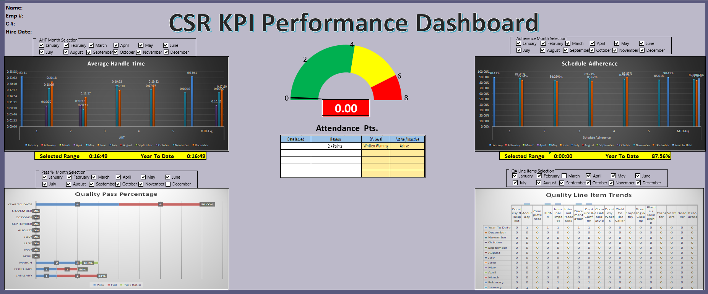
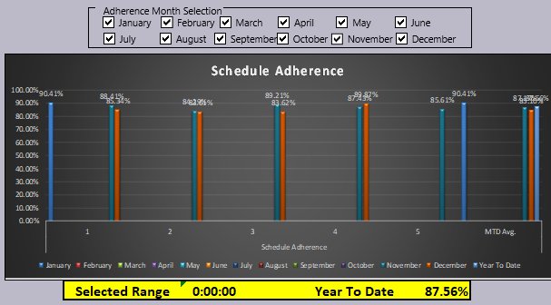
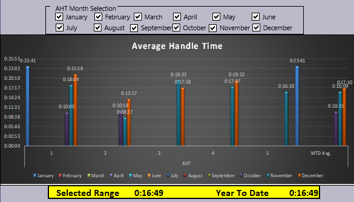
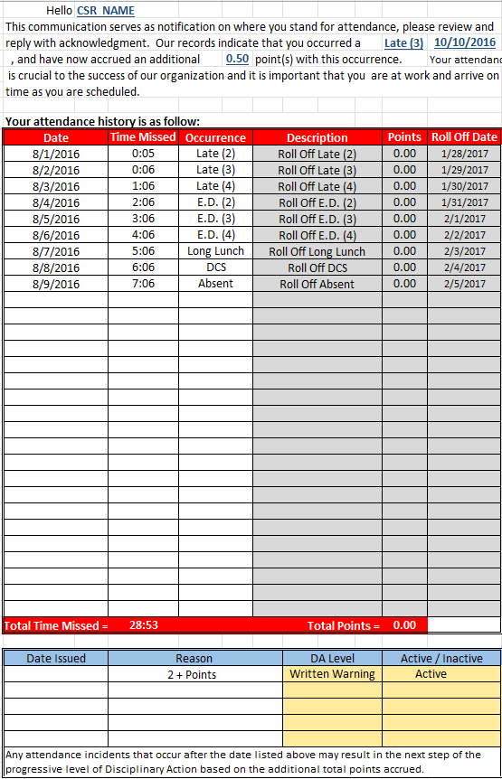
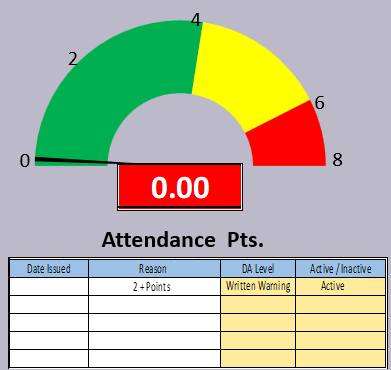
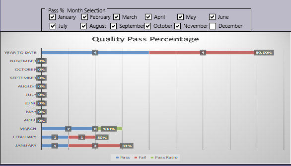
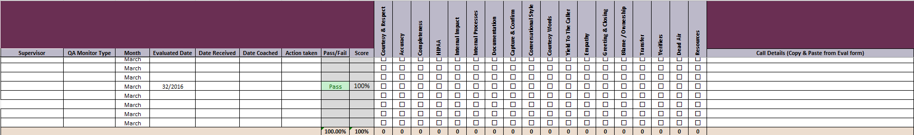
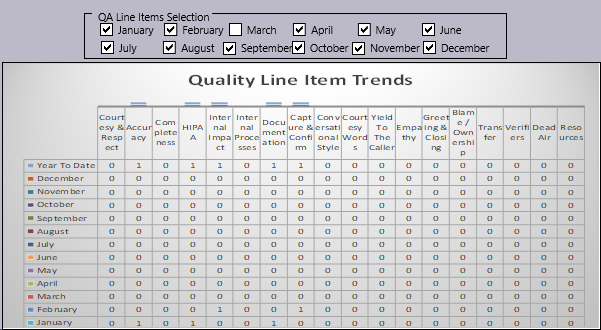
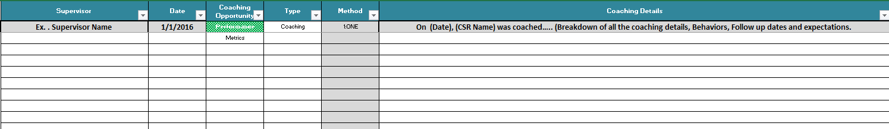

# Operational Performance Dashboard

## Project Overview

The Operational Performance Dashboard project was developed to address the lack of a centralized reporting system for workforce performance metrics within a high-volume call center environment.

At the time, operational data such as schedule adherence, average handle time (AHT), attendance tracking, quality assurance (QA) performance, and coaching activity existed across separate spreadsheets and reporting processes, limiting leadership visibility into employee performance and operational trends.

To improve reporting efficiency and performance visibility, a centralized KPI dashboard was designed and developed in Microsoft Excel. The dashboard consolidated multiple operational metrics into a single interactive reporting system that allowed supervisors and managers to monitor workforce performance, identify coaching opportunities, track attendance escalations, and analyze quality trends across multiple reporting categories.

The system incorporated dynamic filtering, automated calculations, KPI scorecards, trend analysis, attendance point monitoring, QA line item tracking, and coaching documentation workflows. These tools supported proactive performance management, standardized reporting practices, and data-driven operational decision-making.

The dashboard served as both a workforce analytics and performance management solution by providing leadership with a centralized view of operational KPIs and employee performance indicators.

---

## Business Problem

The organization lacked a centralized location for operational performance metrics and workforce reporting. Supervisors and managers relied on multiple spreadsheets and disconnected reporting processes to track employee KPIs, attendance, quality performance, and coaching activity.

This fragmented reporting structure created challenges including:

- Limited visibility into employee performance trends
- Inefficient manual reporting processes
- Inconsistent coaching documentation
- Difficulty tracking attendance escalation levels
- Delayed identification of operational performance issues
- Lack of centralized KPI monitoring

The Operational Performance Dashboard was developed to centralize workforce analytics, improve reporting efficiency, and provide leadership with a unified operational reporting solution.

---

## Dashboard Features

- Centralized KPI dashboard
- Schedule adherence tracking
- Average handle time (AHT) reporting
- Attendance point monitoring
- QA pass/fail performance tracking
- Quality line item trend analysis
- Coaching opportunity tracking
- Attendance escalation management
- Monthly filtering and trend analysis
- Workforce performance scorecards

---

## KPIs Tracked

### Workforce Metrics
- Schedule Adherence
- Average Handle Time (AHT)
- Attendance Points
- Attendance Escalation Levels

### Quality Metrics
- QA Pass Percentage
- QA Line Item Trends
- Quality Failure Tracking
- Coaching Opportunities

### Coaching & Compliance
- Coaching Documentation
- Coaching Follow-Up Tracking
- Disciplinary Action Monitoring
- Operational Accountability Tracking

---

## Tools & Technologies Used

- Microsoft Excel
- Workforce Analytics
- KPI Reporting
- Dashboard Development
- Data Visualization
- Operational Reporting
- Performance Management
- Quality Assurance Monitoring
- Coaching Workflow Management

---

## Repository Structure

```text
dashboard/   -> Excel dashboard files
images/      -> Dashboard screenshots and visualizations
reports/     -> Executive summaries and documentation
```

---

# Sample Visualizations

## Dashboard Overview



Figure 1. Centralized operational dashboard displaying workforce KPIs, attendance metrics, quality tracking, and adherence reporting.

---

## Schedule Adherence Tracking



Figure 2. Schedule adherence dashboard tracking monthly and year-to-date workforce adherence percentages.

---

## Average Handle Time (AHT)



Figure 3. AHT reporting dashboard monitoring call handling efficiency across reporting periods.

---

## Attendance Point Monitoring



Figure 4. Attendance escalation gauge tracking disciplinary attendance point accumulation and action levels.

---

## Attendance Workflow Tracking



Figure 5. Attendance tracking workflow documenting occurrences, escalation history, and disciplinary action status.

---

## Quality Assurance Performance



Figure 6. QA pass percentage dashboard monitoring quality performance trends and pass/fail ratios.

---

## Quality Trend Analysis



Figure 7. Quality line item trend reporting used to identify recurring operational and compliance issues.

---

## QA Evaluation Workflow



Figure 8. QA evaluation tracking form used to document call monitoring categories and operational compliance metrics.

---

## Coaching Documentation Workflow



Figure 9. Coaching documentation workflow used for performance feedback tracking, behavioral observations, and follow-up management.

---

## Business Impact

The dashboard improved operational reporting visibility by centralizing workforce performance metrics into a single reporting system. Leadership teams were able to monitor KPI trends more efficiently, identify coaching opportunities faster, and standardize workforce performance reporting processes.

The project also reduced reliance on disconnected spreadsheets and improved visibility into attendance management, quality assurance trends, and workforce accountability metrics.

---

## Author

Jose Reyes  
MS Business Analytics & Artificial Intelligence  
University of Texas Rio Grande Valley
